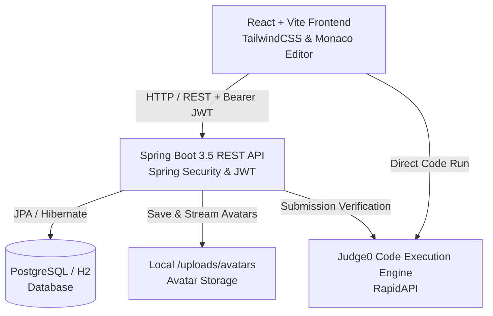

# 🚀 RankQuest — Competitive Programming & DSA Platform

> **RankQuest** is a modern, high-performance competitive programming and Data Structures & Algorithms (DSA) platform. Built for university coding communities and developers worldwide, it features an in-browser code editor, real-time code evaluation via Judge0, institutional and global leaderboards, curated problem sheets, and seamless contributor collaboration.

---

[](https://rank-quest.vercel.app/)
[](https://rankquest-backend.onrender.com)
[](https://github.com/Lokesh-Squazzo/Rank-Quest/graphs/contributors)
[](https://openjdk.org/projects/jdk/21/)
[](https://spring.io/projects/spring-boot)
[](https://react.dev/)
[](LICENSE)

---

## 📑 Table of Contents

- [Overview](#-overview)
- [Screenshots](#-screenshots)
- [Key Features](#-key-features)
- [Tech Stack](#-tech-stack)
- [Architecture](#-architecture)
- [Getting Started](#-getting-started)
  - [Prerequisites](#prerequisites)
  - [Backend Setup](#1-backend-setup-spring-boot)
  - [Frontend Setup](#2-frontend-setup-react--vite)
  - [Docker Setup](#3-running-with-docker)
- [Environment Variables](#-environment-variables)
- [API Overview](#-api-overview)
- [Project Structure](#-project-structure)
- [Testing](#-testing)
- [Contributors](#-contributors)
- [License](#-license)

---

## 🌟 Overview

RankQuest solves the challenge of fractured competitive programming practice in university campuses. It brings together:
1. **Curated Problem Sheets** (e.g., Striver SDE, NeetCode, Blind 75) mapped with hints and test cases.
2. **Integrated Monaco Code Playground** with multi-language execution and live compiler verdicts.
3. **Dual-Tier Leaderboards** separating campus/college peers from global contenders.
4. **Comprehensive Developer Profiles** showcasing problem-solving streaks, submission timelines, custom avatars, and college rankings.

---

## 📸 Screenshots

### 💻 Problem Solver & Code Editor
Write, edit, and test your code in real-time with an integrated Monaco editor and Judge0 evaluation.


### 🏆 Global & College Rankings
Track your progress and compete globally or within your institution to elevate coding culture in college.


---

## ✨ Key Features

- ⚡ **Multi-Language Code Runner**: Powered by the **Monaco Editor** with custom dark theme syntax highlighting. Submits code to **Judge0 API** supporting Java, C++, Python, and JavaScript with execution time and memory limits.
- 🏅 **Dual-Tier Leaderboards**: Compete on the **Global Leaderboard** or filter by your **College/University** to foster healthy peer competition on campus.
- 👤 **Customizable Profile & Avatars**:
  - Upload custom profile pictures via quick camera overlay or drag-and-drop.
  - Choose from 6 developer preset avatars (Neo, Cyber, Pixel, Glitch, Void, Pulse).
  - Track real-time stats: total solved count (Easy/Medium/Hard), current & longest streaks, and ranking percentiles.
- 📜 **Real-Time Submission History**: Live timeline on the user profile displaying problem titles, difficulty badges, programming language used, runtime (ms), memory (KB), and execution status (Accepted, Wrong Answer, TLE).
- 🔐 **Robust Security & Auth**:
  - Stateless JWT token-based authentication (`jjwt`) and BCrypt password encryption.
  - Google OAuth 2.0 single sign-on.
  - In-app password change with current password validation.
  - Self-service **Forgot Password** recovery flow with security tokens.
- 👥 **Dynamic Contributor & About Us Page**: Live integration with GitHub API (`/repos/Lokesh-Squazzo/Rank-Quest/contributors`) tracking total developer commits, contributions, and project tech stack in real-time.
- 🛡️ **Role-Based Admin Portal**: Administrative dashboard for user moderation, problem management, and sheet curation with granular role security (`USER`, `ADMIN`).

---

## 🛠️ Tech Stack

| Layer | Technologies |
| :--- | :--- |
| **Frontend** | React 18, Vite 5, Tailwind CSS, Monaco Editor (`@monaco-editor/react`), Lucide React Icons, Axios |
| **Backend** | Java 21, Spring Boot 3.5, Spring Security 6, Spring Data JPA, Hibernate, JJWT |
| **Databases** | H2 (in-memory for local dev) / PostgreSQL (production on Aiven Cloud) |
| **Code Execution** | Judge0 API (CE edition via RapidAPI) |
| **Deployment** | Vercel (Frontend SPA), Render (Backend Docker Container), Aiven Cloud DB |

---

## 🏗️ Architecture



---

## 🚀 Getting Started

### Prerequisites

Ensure you have the following installed on your system:
- **Git** (version 2.30+)
- **JDK 21** or later ([Eclipse Temurin / OpenJDK](https://adoptium.net/))
- **Node.js** (v18.x or v20.x LTS) & **npm**
- **Docker** *(optional, for containerized execution)*

---

### 1. Backend Setup (Spring Boot)

1. **Navigate to the backend directory:**
   ```bash
   cd Back-End
   ```

2. **Configure Environment Variables (Optional for dev):**
   By default, the backend runs with an in-memory **H2 database** with zero configuration required.
   To connect to a custom PostgreSQL database, set the following environment variables:
   ```bash
   export DB_URL="jdbc:postgresql://localhost:5432/rankquest"
   export DB_USERNAME="postgres"
   export DB_PASSWORD="yourpassword"
   export JWT_SECRET="your-32-byte-secret-key-goes-here"
   ```

3. **Run the backend using the Maven wrapper:**
   - **Linux / macOS:**
     ```bash
     ./mvnw clean spring-boot:run
     ```
   - **Windows:**
     ```powershell
     .\mvnw.cmd clean spring-boot:run
     ```

4. **Verify Backend Health:**
   - Server runs on: `http://localhost:8080`
   - H2 Console available at: `http://localhost:8080/h2-console` (JDBC URL: `jdbc:h2:mem:rankquest`, User: `sa`, Password: *(empty)*)

---

### 2. Frontend Setup (React + Vite)

1. **Navigate to the frontend directory:**
   ```bash
   cd Front-End
   ```

2. **Install dependencies:**
   ```bash
   npm install
   ```

3. **Configure Environment Variables:**
   Copy the sample environment file or create `.env`:
   ```bash
   cp .env.example .env
   ```
   Add your Judge0 API key and backend URL:
   ```env
   VITE_API_BASE_URL=http://localhost:8080/api
   VITE_JUDGE0_API_KEY=your_rapidapi_judge0_key_here
   ```

4. **Start the development server:**
   ```bash
   npm run dev
   ```

5. **Open RankQuest in your browser:**
   ```
   http://localhost:5173
   ```

---

### 3. Running with Docker

You can build and run the backend using Docker:

```bash
cd Back-End
docker build -t rankquest-backend .
docker run -p 8080:8080 -e JWT_SECRET="your-secure-jwt-key" rankquest-backend
```

---

## 🔑 Environment Variables

### Backend (`Back-End/src/main/resources/application.properties`)

| Variable | Default Value | Description |
| :--- | :--- | :--- |
| `server.port` | `8080` | Port on which the Spring Boot server listens |
| `DB_URL` | `jdbc:h2:mem:rankquest;...` | JDBC database URL (PostgreSQL in production) |
| `DB_USERNAME` | `sa` | Database username |
| `DB_PASSWORD` | *(empty)* | Database password |
| `JWT_SECRET` | *(built-in 256-bit default)* | HMAC SHA-256 secret key for signing tokens |
| `JWT_EXPIRATION_MS`| `86400000` (24 hours) | Token validity duration in milliseconds |

### Frontend (`Front-End/.env`)

| Variable | Default Value | Description |
| :--- | :--- | :--- |
| `VITE_API_BASE_URL` | `http://localhost:8080/api` | Base URL for the Spring Boot backend REST endpoints |
| `VITE_JUDGE0_API_KEY`| *(Required)* | RapidAPI Judge0 API Key for code compilation |

---

## 📡 API Overview

A complete, detailed OpenAPI/REST specification is available at [API_Specification.md](Front-End/src/docs/API_Specification.md).

| Method | Endpoint | Description | Auth Required |
| :--- | :--- | :--- | :---: |
| `POST` | `/api/auth/register` | Register a new user | No |
| `POST` | `/api/auth/login` | Authenticate and obtain JWT token | No |
| `POST` | `/api/auth/reset-password` | Reset password using security token | No |
| `GET` | `/api/users/profile` | Retrieve authenticated user profile | Yes |
| `PUT` | `/api/users/profile` | Update profile information | Yes |
| `PUT` | `/api/users/password` | Change password with current password verification | Yes |
| `POST` | `/api/users/avatar` | Upload profile avatar (Multipart) | Yes |
| `GET` | `/api/users/avatar/{filename}`| Stream user avatar image | No |
| `GET` | `/api/problems` | List DSA problems with filters | No |
| `GET` | `/api/problems/{id}` | Get problem details and test cases | No |
| `POST` | `/api/submissions` | Submit code for Judge0 verification | Yes |
| `GET` | `/api/submissions/user` | Fetch submission history for authenticated user | Yes |
| `GET` | `/api/rankings` | Fetch global & college leaderboard | No |

---

## 📁 Project Structure

```text
RankQuest/
├── Back-End/
│   ├── src/
│   │   ├── main/java/com/rankquest/
│   │   │   ├── config/              # SecurityConfig, CorsConfig, PasswordEncoder
│   │   │   ├── controller/          # REST Controllers (Auth, User, Problems, etc.)
│   │   │   ├── dto/                 # Request & Response payload models
│   │   │   ├── entity/              # JPA Database Entities (User, Problem, Submission)
│   │   │   ├── repository/          # Spring Data JPA Repositories
│   │   │   └── service/             # Business Logic & Service Implementations
│   │   └── resources/
│   │       ├── application.properties
│   │       └── data.sql             # Default seed data (sheets, problems)
│   ├── uploads/avatars/             # Local avatar storage (auto-created)
│   ├── Dockerfile                   # Multi-stage container build
│   └── pom.xml                      # Maven dependencies
├── Front-End/
│   ├── src/
│   │   ├── components/
│   │   │   ├── auth/                # ProtectedRoute, Auth modals
│   │   │   ├── layout/              # Navbar, Footer, Sidebar
│   │   │   └── ui/                  # Reusable badges, cards, buttons
│   │   ├── context/                 # AuthContext (JWT & state management)
│   │   ├── pages/
│   │   │   ├── Dashboard.jsx        # Landing page & Hero
│   │   │   ├── ProblemSolver.jsx    # Monaco code editor & Judge0 runner
│   │   │   ├── Rankings.jsx         # Global & College leaderboards
│   │   │   ├── Profile.jsx          # User stats, avatar & submission history
│   │   │   ├── Settings.jsx         # Avatar selector, password change
│   │   │   ├── About.jsx            # Contributors & GitHub stats page
│   │   │   └── admin/               # Admin management portal
│   │   ├── services/
│   │   │   └── apiService.js        # Axios instance & API client functions
│   │   └── docs/
│   │       └── API_Specification.md # Full API documentation
│   ├── index.html
│   ├── package.json
│   ├── tailwind.config.js
│   └── vite.config.js
└── README.md
```

---

## 🧪 Testing

### Backend Unit & Integration Tests
Run the comprehensive Spring Boot test suite (including authentication, password update, and avatar integration):
```bash
cd Back-End
./mvnw test
```

### Frontend Build Validation
Verify production bundles and assets without errors:
```bash
cd Front-End
npm run build
```

---

## 🤝 Contributors

RankQuest is developed and maintained with ❤️ by passionate developers:

| Contributor | GitHub Profile | Role |
| :--- | :--- | :--- |
| **Lokesh** | [@Lokesh-Squazzo](https://github.com/Lokesh-Squazzo) | Creator & Lead Full-Stack Architect |
| **Jayesh** | [@Jayesh067](https://github.com/Jayesh067) | Core Contributor |

Want to contribute? Check out our [About Us & Contributors Page](https://rank-quest.vercel.app/about) or open a Pull Request!

1. Fork the Project
2. Create your Feature Branch (`git checkout -b feature/AmazingFeature`)
3. Commit your Changes (`git commit -m 'feat: Add some AmazingFeature'`)
4. Push to the Branch (`git push origin feature/AmazingFeature`)
5. Open a Pull Request

---

## 📄 License

Distributed under the **MIT License**. See `LICENSE` for more information.
